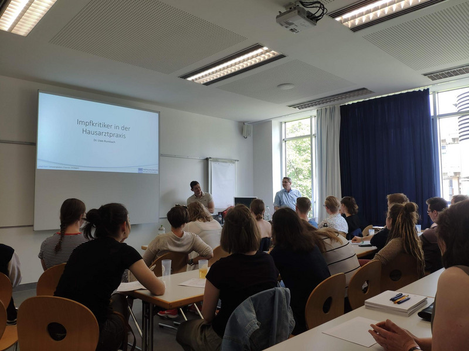
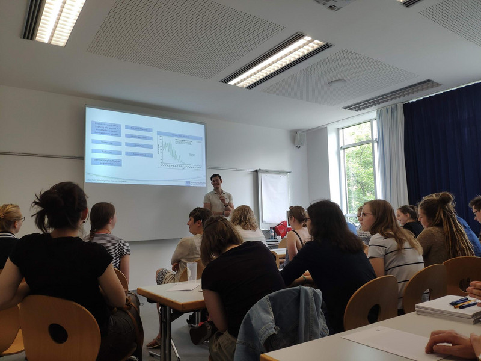
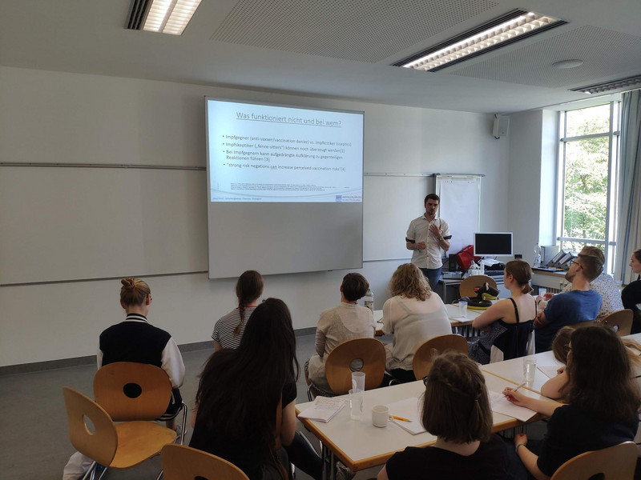

Ein erfolgreiches Wochenende: Unsere Kooperation mit der BPhD wurde weiter gestärkt!

"Impf Dich" war vergangenes Wochenende beim PharmaWeekend des Bundesverbands der Pharmaziestudierenden in Deutschland eingeladen. Viele interessante Vorträge, unter anderem durch Vertreter des RKI, PEI und STIKO, machten das Wochenende sehr informativ und unterhaltsam.

Wir von "Impf Dich" (Manuel Kuhlmann, Dr. Uwe Rumbach, Simon Hennes) gestalteten einen Workshop zum Thema „Impfaufklärung in Deutschland – Schwierigkeiten, Chancen, Strategien“. Mit viel Interesse wurde über die aktuelle Impf-Situation und Lösungsvorschläge diskutiert. Unsere Initiative hat sich ebenfalls in großen Plenum vorgestellt.

Viele Pharmaziestudierende sprachen uns am Wochenende an und wollen an verschiedenen Lokalgruppen mitmachen und sogar neue gründen.

#### Mehr Infos finden sich auf der [Seite der BPhD](https://www.bphd.de/pressemitteilung-zum-17-pharmaweekend-in-heidelberg/)

