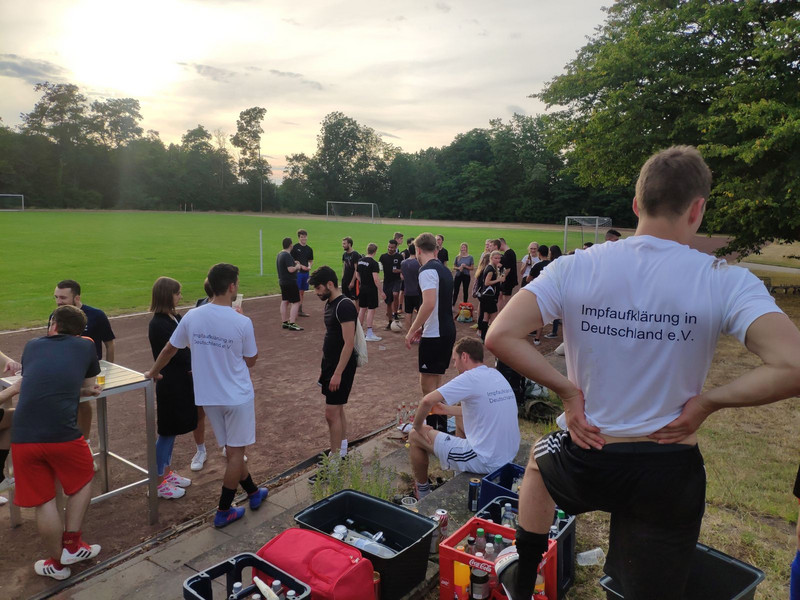
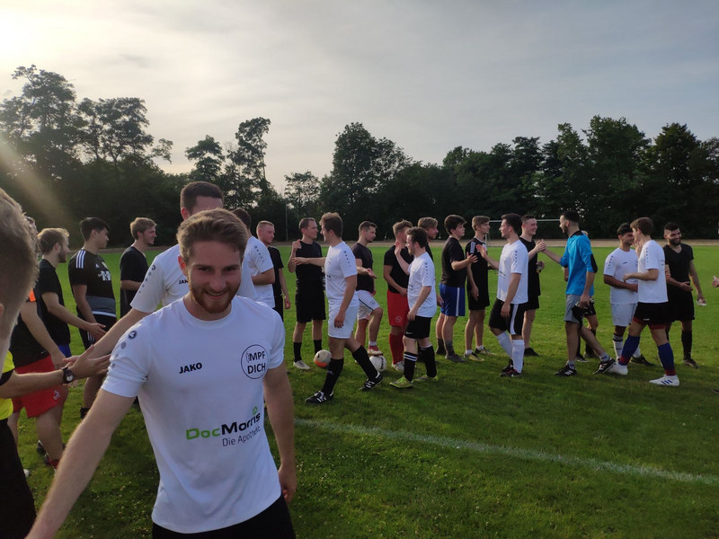
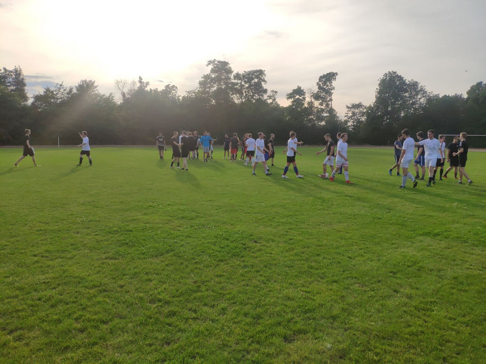
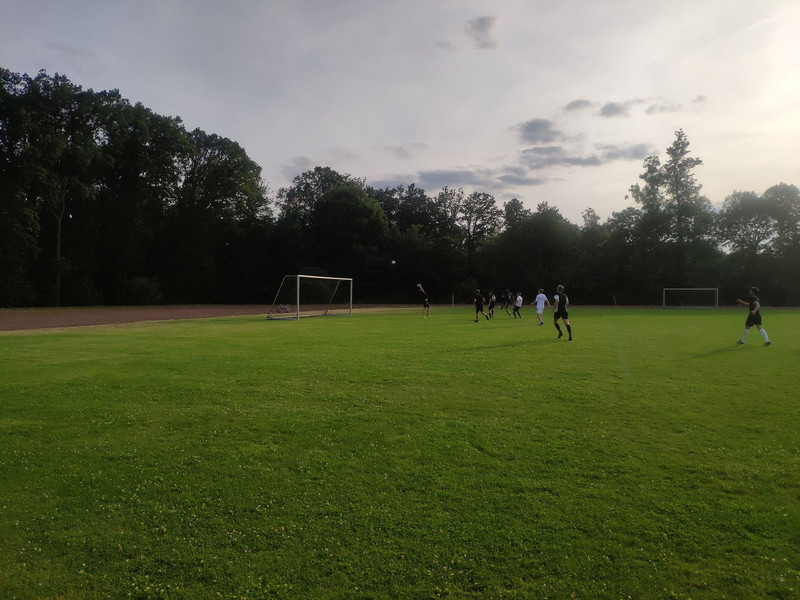

_7:0 fegen die Mediziner die Pharmazeuten vom Feld - Benefizspiel war auch in diesem Jahr wieder ein voller Erfolg_

Zum Spielverlauf:   
Bei besten Bedingungen in der Sportanlage Nachtigallenweg trafen die Mediziner im klassischen Weiß auf eine Pharmazeuten-Auswahl. Noch dunkler als deren Trikots war leider nur der Fußballabend aus Pharma-Sicht. Schon früh musste der Pharma-Keeper hinter sich greifen und bereits zur Halbzeit führten die Mediziner nach zwei tollen Einzelaktionen von Soufian Ben Amar und einem klasse Assist von Steffen Künzel mit 2:0. Trotz Einwechslung zahlreicher Pharmazeuten-Altstars um Dominik Heuchel, Fabian Krebs oder dem angeschlagenen Swen Bremer und tollen Einzelaktionen von Ali Taleb und Linus Korsmeier, schwamm die Pharmazeuten-Abwehr in der zweiten Halbzeit komplett. Es wurde zum Spiel in eine Richtung. Das Tor des Abends schoss der Vorsitzende Steffen Künzel persönlich zum 4:0 mit einem satten Schuss oben links. Dominik Heuchel, Spieler der Pharmazeuten, war nach dem Spiel bedient: "So darf man sich hier nicht präsentieren. Die Mediziner haben am Ende ein oder zwei Gänge zurückgeschaltet und waren trotzdem die spielbestimmende Mannschaft. Da müssen wir uns alle zusammenreißen. Letztendlich war die individuelle Klasse eines Ben Amar und vor allem eines Steffen Künzel dann einfach zu viel für unsere Abwehr. Im nächsten Jahr greifen wir wieder an." Am Ende hieß es 7:0 und der Wanderpokal verbringt ein weiteres Jahr in Mediziner-Hand. Ein besonderes Dankeschön geht an den - wie im letzten Jahr - souveränen Schiedsrichter Florian Lutz.

Berichterstattung und Spieler des Spiels: Steffen Künzel

