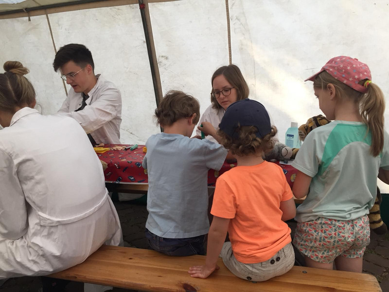

Ein paar Eindrücke der letzten Aktionen im Juli aus Heidelberg vor der Sommerpause..  
Dieses Jahr fand zum ersten Mal eine Impfstation am Heidelberger Teddybär-Krankenhaus statt. Mit großer Begeisterung haben die Kinder ihre Kuscheltiere geimpft und die Teddy-Impfpässe gestempelt.

Im Rahmen eines Projekttages konnten knapp 100 Schüler\*innen aufgeklärt werden. Besonders dazu beigetragen hat die Unterstützüng und Fragerunde von Frau Schneider vom Bundesverband Polio e.V.!

