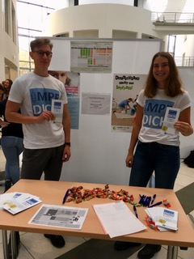
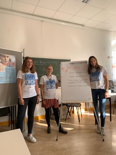

Zum zweiten Mal waren wir als Lokalgruppe Berlin des Vereins für Impfaufklärung bei der Campustour für die neuen Erstsemester mit einer Station vertreten. Mit unserem Impf-Tabu wollten wir auf das Thema aufmerksam machen und Interesse an unserer AG wecken. Auch beim AG-Marktplatz waren wir natürlich dabei und haben fleißig Fragen beantwortet und über unsere Arbeit aufgeklärt. 

Nach diesem erfolgreichen Start in das neue Semester freuen wir uns auf weitere produktive AG-Abende und neue Projekte rund ums Thema Impfen. 

