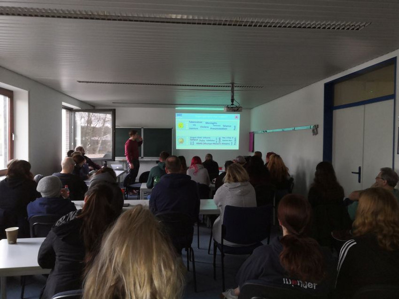
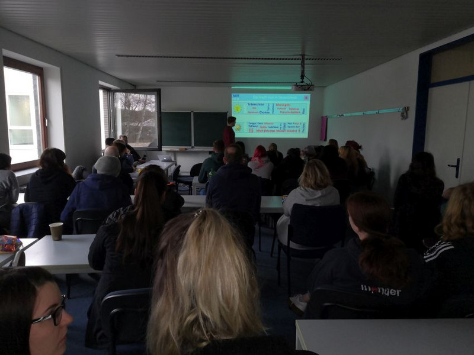
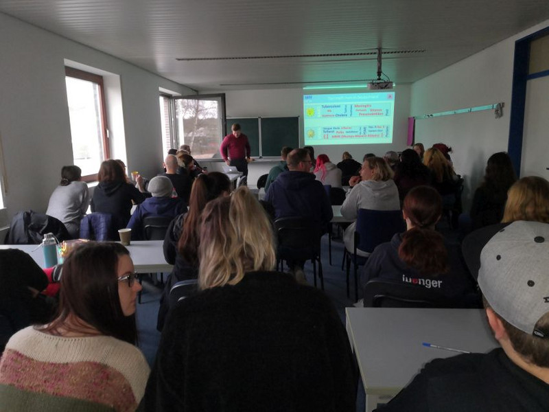

Eigentlich ging alles relativ zügig. Auf einer Veranstaltung der KSK Sozialstiftung Köln, lernte ich die Initiatoren der Aktion „Impf Dich!“ des Vereins für Impfaufklärung in Deutschland e.V. kennen. Im Gespräch über das Projekt, habe ich mich als Fachlehrerin für Pflege und Gesundheit M.A. spontan von der Wichtigkeit einer Aufklärungsveranstaltung für unsere Schüler\*innen entschieden.

Im Berufskolleg der Heilerziehungspflege, Berufskolleg Sozialpädagogik und der Pflegeschule bilden wir Berufsgruppen aus, welche in ihrem Arbeitsalltag in unterschiedlichen Kontexten mit dem Thema „Impf dich!“ in Berührung kommen. Sei es eine Impfempfehlung für Menschen mit reduziertem Immunstatus wie chronisch Erkrankte, behinderte und/oder alternde Menschen, die Sicht auf die Impfpflicht und Auswirkungen von Impfungen bei typischen Kinderkrankheiten, sowie Impfungen zur eigenen Gesundheitsfürsorge.

Das Ziel der Aufklärung verfolgt den Zuhörer\*innen auf der Grundlage aktueller wissenschaftlicher Erkenntnisse in eine Pro und Kontra Diskussion einzusteigen, eine Risikoabschätzung durch zuführen und die eigene Meinung zu evaluieren.

Anhand der Rückmeldung der Schüler\*innen scheint es gelungen die unterschiedlichen Fragen zu beantworten und auch eigene Gefühle zum Thema Impfen entsprechend zu würdigen. Eine Aussage einer Schülerin möchte ich hier repräsentativ wiedergeben: Ich habe gestern im TV eine Diskussionsrunde zwischen Impfbefürworter und Impfgegner gesehen und konnte die einzelnen Argumente viel besser verstehen und nachvollziehen. Mit fiel auch auf, dass einzelne Argumente die neuesten Erkenntnisse nicht berücksichtigten.

Quelle: Bericht der IWK Waldbröl - [https://www.iwk.eu/aktuelles-waldbroel?start=3](https://www.iwk.eu/aktuelles-waldbroel?start=3)

