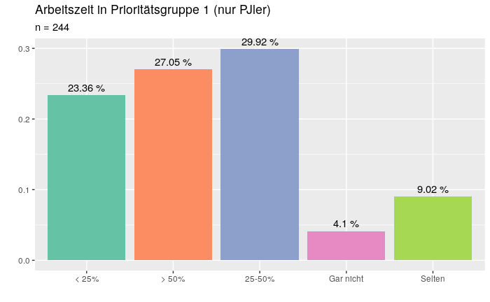
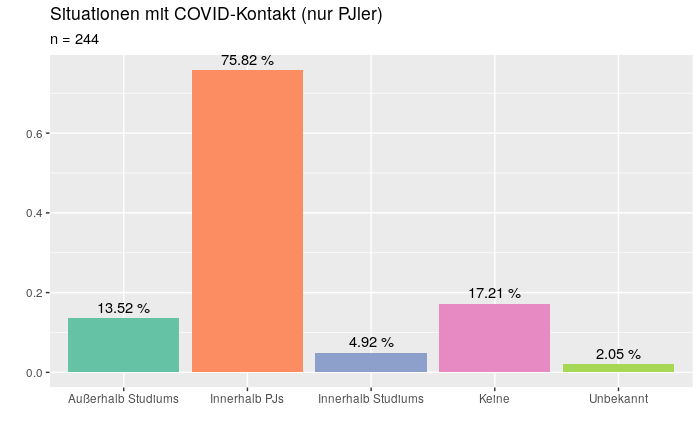
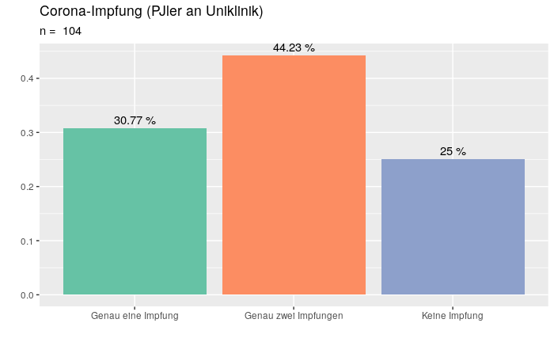
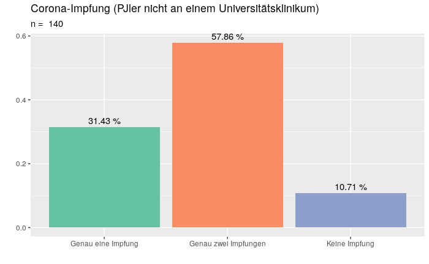
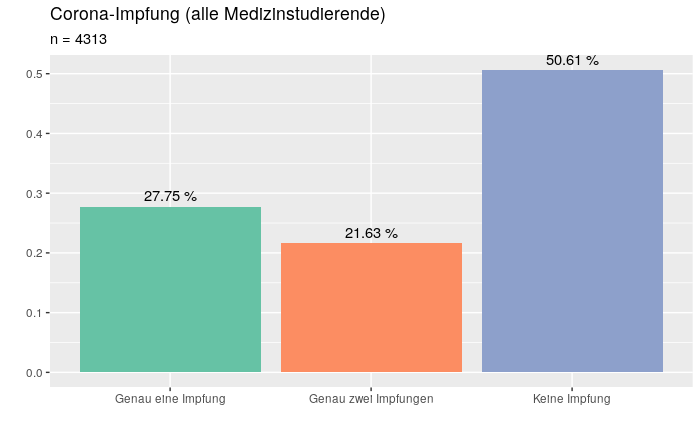
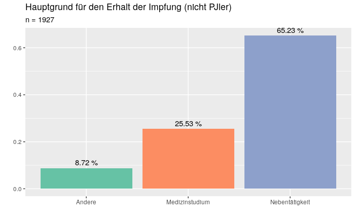
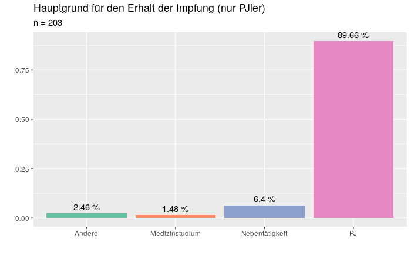
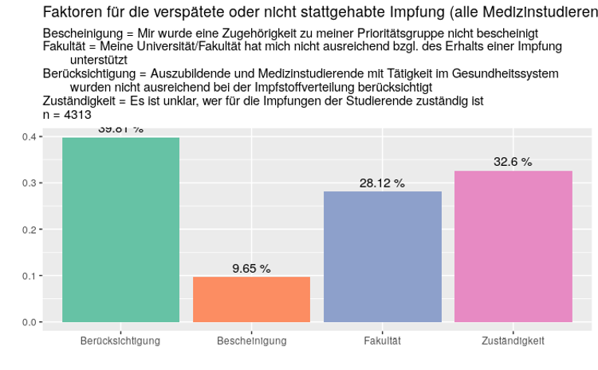
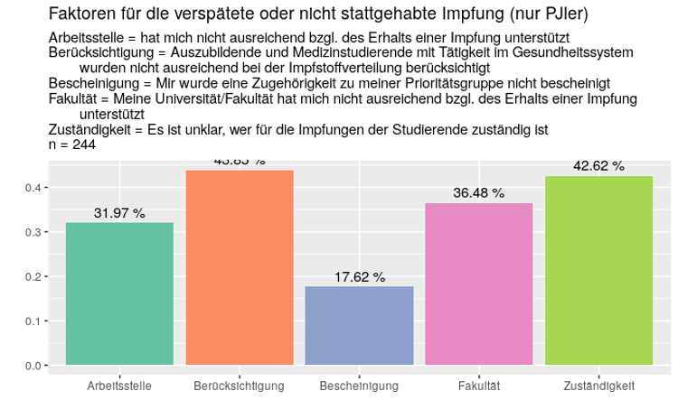
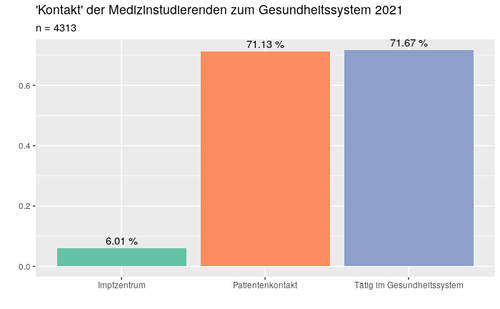

Im Rahmen der gemeinsamen [Pressemitteilung/ Stellungnahme](https://www.bvmd.de/fileadmin/user_upload/2021-08-04_PM_Eine_vermeidbare_Gef%C3%A4hrdung_-_bvmd_und_Impf_Dich_ver%C3%B6ffentlichen_Daten_zu_Infektionszahlen_und_Fehlern_in_der_Impfkampagne_f%C3%BCr_Medizinstudierende.pdf) der Bundesvertretung der Medizinstudierenden in Deutschland e.V. (bvmd) und der Initiative Impfaufklärung in Deutschland e.V. (“Impf Dich”) haben wir erste Erkenntnisse der von uns initiierten COVRAM-Umfrage (COVID-19 Vaccination Readiness Assessment of Medical Students) veröffentlicht. Wir danken der Uni Erfurt und dem Communication Lab Erfurt für Feedback und Input zum Fragebogen und der Vorgehensweise. Das Ethik-Votum ([Link](https://impf-dich.org/_Resources/Persistent/f/e/3/4/fe344a0c13af576438eec1fe2758f754dc379188/Angenommener%20Ethikantrag_Erfurt_Mitteilung%20an%20die%20Antragsteller_eng.pdf)) wurde von der Universität Erfurt angenommen. 

Die Umfrage ist an der [COSMO-Umfrage](https://projekte.uni-erfurt.de/cosmo2020/web/) orientiert, ähnelt vom Aufbau auch der [KROCO-Umfrage](https://www.rki.de/DE/Content/InfAZ/N/Neuartiges_Coronavirus/Projekte_RKI/Kroco-Report150721.pdf?__blob=publicationFile) des RKIs und wurde spezifisch für das Setting der Medizinstudierenden angepasst.

Der komplette Fragebogen ist hier abzurufen: [Fragebogen](https://impf-dich.org/_Resources/Persistent/d/7/4/f/d74f75130ca971706067b8d6ec9f2f395032ec73/Codebuch%20f%C3%BCr%20Auswertung.pdf)

Nahezu alle Fachschaften und Dekanate der medizinischen Fakultäten wurden kontaktiert, um den Online-Fragebogen an möglichst alle Medizinstudierende verteilen zu können. Insgesamt konnten 4313 Medizinstudierende aus ganz Deutschland eingeschlossen werden.

Die Medizinstudierenden beantworteten im Zeitraum vom 30.03.2021 bis zum 18.04.2021 unter anderem Fragen zum Infektionsstatus, Impfbereitschaft und Risikowahrnehmung. Sie machten zum Teil die Krankenhäuser, die med. Fakultäten und die Politik für die Ungleichbehandlung gegenüber dem restlichen Personal verantwortlich.

Insbesondere Medizinstudierende im PJ waren dauerhaft in Krankenhäusern und in der Gesundheitsversorgung im Einsatz und hatten entsprechend (Risiko-) Patient:innenkontakt. Das spiegelt sich auch in der COVRAM-Umfrage wider. In dieser Gruppe gaben 75,8% an, Kontakt zu akuten COVID-19-Fällen im Rahmen des Praktischen Jahres gehabt zu haben. Knapp 60% der PJ-Studierenden gaben eine Arbeitszeit von mehr als 25% und 28% sogar eine Arbeitszeit von über 50% im Arbeitsbereich der Impf-Prioritätsgruppe 1 gemäß STIKO an.

Aus den Daten der COVRAM-Studie lässt sich außerdem schließen, dass die **Medizinstudierenden im Praktischen Jahr (PJ) fast doppelt so häufig infiziert** waren, wie die Gesamtheit der Medizinstudierenden, deren Infektionsrate sich ungefähr auf dem Niveau der entsprechenden Altersgruppe in Deutschland zu dem Zeitraum befand. Sich im Praktische Jahr zu befinden, scheint daher mit einem erheblich erhöhten Risiko für eine COVID-19-Infektion einherzugehen. Auch in den [Daten der AOK](https://www.aerzteblatt.de/archiv/220234/COVID-19-Pandemie-Pflegende-deutlich-haeufiger-krank) zu den Infektionszahlen und der Betroffenheit der Pflege während der Coronapandemie zeigt sich, dass besonders hoher Patient:innenkontakt mit einem hohen Infektionsrisiko verbunden ist.

**Insbesondere die Gruppe der PJ-Studierenden an Universitätskliniken** mussten **lange ohne Impfung**auskommen: 25% der PJler:innen, die als Arbeitsort ein Universitätsklinikum und 10,7%, die als Arbeitsort ein anderes Klinikum angegeben haben, waren zum Zeitpunkt der Umfrage noch gänzlich ungeimpft. Die Daten der COVRAM-Studie und der PJ-Alltag zeigen, dass die allermeisten Medizinstudierenden im PJ in die Gruppe des “Risikopersonals” einzuordnen sind, wie es in der [KROCO-Befragung](https://www.rki.de/DE/Content/InfAZ/N/Neuartiges_Coronavirus/Projekte_RKI/Kroco-Report150721.pdf?__blob=publicationFile) des RKI definiert wird. Die Daten aus der KROCO-Umfrage im fast deckungsgleichen Zeitraum zeigen, dass reguläres "Risikopersonal” deutlich konsequenter geimpft wurde (68% vollständig), als die PJ-Studierenden: Im Zeitraum der Umfrage waren nur 52% aller im PJ befindlichen Studierenden vollständig geimpft. Diese Diskrepanz zeigt sich auch im Vergleich zum ärztlichen Personal: 78% waren dort vollständig und nur 7% gar nicht geimpft.   
In der COVRAM-Studie berichteten die Medizinstudierenden immer wieder von klaren und bewussten **Verstößen bei der Handhabung der Priorisierung und dem konkreten Ausschluss vom Zugang** zu den COVID-19-Impfungen von Seiten der Kliniken.

„**Einhaltung des Arbeitsschutzes und der STIKO-Empfehlungen** bedeutet eben nicht pauschal zwischen Berufsgruppen und aufgrund des Ausbildungsstatus zu differenzieren, sondern insbesondere auf Basis des individuellen Risikokontakts“, so Manuel Kuhlmann, Co-Leiter der Studie und Vorstandsmitglied von „Impf Dich“.

Im Zeitraum der Umfrage waren 50.6% aller befragten Medizinstudierenden ungeimpft, 27,75% hatten eine und 21,63% zwei Impfungen erhalten; wobei über 60% der Nicht-PJ-Studierenden angaben, ihre Impfungen im Rahmen von Nebentätigkeiten erhalten zu haben. Fast 10% der Teilnehmenden im PJ haben Ihre Impfung nicht aufgrund ihres PJs allein bekommen. Die Impfquoten der Medizinstudierenden sind auch auf das Engagement einiger Fakultäten zurückzuführen. Hier sind der bvmd **deutliche Unterschiede** zwischen verschiedenen Fakultätsstandorten, Lehrkrankenhäusern und Universitätskliniken bekannt.

28,12 % aller Medizinstudierenden sowie 36,48% der PJ-Studierenden gaben als einen Grund für eine verspätete oder bis zum Zeitpunkt der Befragung ausgebliebene Impfung an, dass ihre Universität/Fakultät sie nicht ausreichend bzgl. des Erhalts einer Impfung unterstützt hat. **Mangelnde Unterstützung** der Arbeitsstelle gaben 31,97% der PJ-Studierenden an. Unklare Zuständigkeiten sahen 32,6% bzw. 42,6% der PJler:innen als einen der Gründe in diesem Zusammenhang an. Leider wurde Medizinstudierenden auch vielfach das Ausstellen einer Bescheinigung zur Berechtigung zur Impfung verweigert. Das gaben 17,6% aller Studierenden im PJ und knapp 13% aller Ungeimpften insgesamt als einen der Faktoren an. Viele Medizinstudierende kritisierten zudem die **mangelnde Unterstützung und Berücksichtigung von der Politik** für die im Gesundheitssystem tätigen Medizinstudierenden beim Erhalt der Impfungen und machen u.a. die Organisation und Bürokratie der Impfkampagne und unklare Zuständigkeiten als einen Grund für einen schlechteren Erhalt der Impfungen aus.

Die Studie zeigte außerdem eine überwältigende Impfbereitschaft für eine COVID-Impfung, weswegen bei adäquatem Angebot eine nahezu hundertprozentige Impfquote der Medizinstudierenden zu erwarten ist.

Die Erhebungen im Rahmen der COVRAM-Studie zeigen, dass sich viele Medizinstudierende neben ihrem Studium im Rahmen der Pandemiebewältigung (z.B. in Impfzentren) engagiert haben. Das überwältigende Engagement der Medizinstudierenden bestätigt sich auch in den Zahlen der Plattformen [match4healthcare](https://match4healthcare.de/mapview/) sowie [Studis4ÖGD](https://www.bvmd.de/fileadmin/user_upload/2021-02-24_PM_Studis4ÖGD_-_Erfolgsgeschichte_wird_fortgesetzt.pdf). Knapp jeweils 71% aller befragten Medizinstudierenden gaben in der Umfrage an, im Januar bis März 2021 Patient:innenkontakt gehabt zu haben oder im Gesundheitssystem tätig gewesen zu sein.

„Die Erkenntnisse der COVRAM-Umfrage zeigen eindrucksvoll, **wie wichtig Impfaufklärung und Impfungen für die Medizinstudierenden in Deutschland sind**. Hier gab es viele Versäumnisse und gibt es dringenden Nachholbedarf.” sagt Simon Hennes, Vorstandmitglied von „Impf Dich“ sowie Initiator und einer der Leiter der COVRAM-Studie. „Die Ergebnisse der Studie, die weit über die hier genannten Daten hinausgehen, werden ausführlich in wissenschaftlichen Zeitschriften veröffentlicht und damit allen Verantwortlichen und Interessierten zur Verfügung gestellt.”

Auf Basis der Daten der COVRAM-Studie wird ein Paper zum Status und dem Wunsch bzgl. der Lehre zu Impfaufklärung und Impfungen im Medizinstudium veröffentlicht, was noch diesen Monat eingereicht werden soll. Auf den Aufbau und die Limitationen der Studie wird ausführlicher noch in diesem Paper eingegangen. Zusätzlich ist ein großes psychologisches Paper geplant, das die Hintergründe der Impfbereitschaft und das Risiko der Medizinstudierenden in Deutschland beleuchten wird. Erst da können einige detaillierte Daten veröffentlicht werden, da sonst die Paper nicht angenommen werden könnten.

**Aufgrund der Ergebnisse der COVRAM-Studie empfehlen und fordern wir u.a.**

*   die Einhaltung des laut Arbeitsschutzgesetz vorgegebenen Gleichbehandlung der in der Versorgung tätigen Medizinstudierenden mit den restlichen Mitarbeitenden in der Gesundheitsversorgung durch sämtliche Einrichtungen hinsichtlich des Zugangs zu Arbeitsschutzmaßnahmen inkl. Impfungen, sowie klinikinterne (digitale) Informationssysteme, Zugang zu Tests, Schulungen/Trainings, Schutzmaterialien etc.
*   Bundeseinheitliche Regelungen und feste Verantwortlichkeiten, um den Zugang zu Impfungen lediglich aufgrund des Risikos/Tätigkeitsbereiches und nicht aufgrund von Zugehörigkeiten zu Berufsgruppen bzw. des Studierendenstatus zu differenzieren
*   eine Fehleranalyse der Umsetzung der Impfpriorisierung bzgl. der Impfungen des medizinischen Personals, um dann ggf. Rückschlüsse ziehen zu können für eine die weitere Impfstoffverteilung und Impfkampagne, für Auffrischimpfungen oder Impfungen für bestimmte Mutationen, oder zukünftige Pandemien

Die vollständigen Forderungen und Handlungsempfehlungen bvmd  und “Impf Dich” aufgrund der Ergebnisse der COVRAM-Studie finden Sie in der [gemeinsamen Pressemitteilung.](https://www.bvmd.de/wer-wir-sind/presse/pressemitteilungen)

**Subgruppen-Analyse: Engagement in Impfaufklärungsinitiative**

1,74% bzw. 75 der Befragten gaben an, dass sie sich “in einer organisierten Initiative für Impfaufklärung (z.B. Impfaufklärung in Deutschland e.V.)” engagieren. Neben den Ergebnissen, die schon in der gemeinsamen Pressemitteilung veröffentlicht und kommentiert wurden, wollen wir auf diese Subgruppe eingehen.  Es kann davon ausgegangen werden, dass die große Mehrheit dieser Studierenden tatsächlich bei “Impf Dich” engagiert sind, wobei auch andere “Impfaufklärungsinitiativen” denkbar sind.

Die relativ kleine Größe dieser Gruppe bringt natürlich gewisse Limitationen in der Auswertung mit sich. Trotz der ungefähr gleichen Geschlechts-, Alters- und Semesterverteilung, wie die Gesamtheit der Studierenden, wies diese Gruppe jedoch z.T. deutliche Unterschiede zu den anderen Studierenden auf. Wir werden zum jetzigen Zeitpunkt hier nur auf die Variablen eingehen, die auch in der gemeinsamen Pressemitteilung Erwähnung fanden.

Hervorzuheben ist, dass die in einer Initiative für Impfaufklärung engagierten Studierenden im Vergleich zu der Gesamtheit der Medizinstudierenden häufiger im Gesundheitssystem gearbeitet haben und mehr Patientenkontakt hatten. Bemerkenswert ist, dass 16% dieser Gruppe angegeben hat, dass sie während der Krise in Impfzentren gearbeitet hat. Gegenüber den restlichen Studierenden ist dieser Anteil deutlich höher. Dieses Engagement fand neben Studium und Praktischem Jahr statt. Sie haben die größte Impfbereitschaft, auch für die verschiedenen Impfstoffe, und sind häufiger geimpft. Eine wichtige Erkenntnis der COVRAM-Studie war, dass Studierende im Praktischen Jahr die Gruppe sind, die am häufigsten mit SARS-CoV-2 infiziert war. Darauf wird auch besonders in der gemeinsamen Pressemitteilung eingegangen. Studierende in einer Impfaufklärungs-Initiative waren jedoch nur minimal seltener infiziert als die Gruppe der Medizinstudierenden im Praktischen Jahr. Auch gaben Sie mehr Infektionen im Umfeld an.

Es scheint als wären Medizinstudierende, die sich in einer Impfaufklärungsinitiative wie “Impf Dich” engagieren, während der Corona-Pandemie im Gesundheitssystem und in der direkten Erhöhung der Impfquote besonders aktiv. Der Vorstand von “Impf Dich” freut sich sehr über diese Ergebnisse und sieht sie als Bestätigung dafür, dass die bei “Impf Dich” Engagierten sich ehrlich für andere und höhere Impfquoten einsetzen und im Studium und auch als Ärztinnen und Ärzte ihren Beitrag leisten werden.