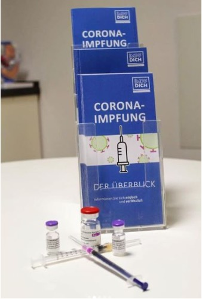

Für alle von uns war das Jahr 2021 eine große Herausforderung, so auch für uns als Verein und unsere Impfaufklärung. Dennoch haben wir auch in diesem Jahr viele Projekte durchführen können und viel bewegen können. Hier noch einige Einblicke in das Jahr 2021 aus der Sicht von “Impf Dich”.

### _**Neue Lokalgruppen**_

 Wir freuen uns sehr, dass wir in diesem Jahr insgesamt 5 neue Lokalgruppen bei uns begrüßen durften. Mit diesem Zuwachs für die Impf Dich-Familie kann die Impfaufklärung an weiteren Standorten vorangetrieben werden.

Jetzt sind wir auch in folgenden Städten vertreten:

*   [Köln](https://impf-dich.org/de/lokalgruppen/koeln)
*   [Würzburg](https://impf-dich.org/de/lokalgruppen/wuerzburg)
*   [Mainz](https://impf-dich.org/de/lokalgruppen/mainz)
*   [Coburg](https://impf-dich.org/de/lokalgruppen/coburg)
*   [Frankfurt](https://impf-dich.org/de/lokalgruppen/frankfurt)

 Schön, dass ihr bei uns seid, wir sind gespannt auf eure ersten Projekte.

### _**Flyer zur COVID-19 Impfung:**_

 Einer unserer großen Erfolge dieses Jahr war das Flyer-Projekt der Lokalgruppe Bonn. Im Mai wurde die erste Version der Flyer im Raum Bonn **in Arztpraxen, Apotheken und Impfzentren ausgelegt**. Die Flyer behandeln wichtige, evidenzbasierte Informationen zu den COVID-19 Impfungen und den dazu zugelassenen Impfstoffen. Die Fülle an Informationen zu diesem Thema ist vor allem im Internet sehr groß.  Doch nicht oft findet man eine übersichtliche und gut verständliche Zusammenfassung der wichtigsten Fakten.

Nachdem die Flyer eine so große Nachfrage generiert hatten, haben wir das Projekt auf Bundesebene ausgeweitet und im Oktober nochmals eine überarbeitete und aktualisierte Version des Flyers bereitgestellt.

Eine PDF-Version des Flyers ist [hier](https://impf-dich.org/de/impf-info/covid-19/flyer) zu finden. 

### _**Bundestreffen in Berlin**_

 Nach einem Jahr Pause konnten wir uns dieses Jahr endlich wieder, unter strengen Infektionsschutzauflagen, persönlich zu einem Bundestreffen versammeln. Dazu kamen Engagierte aus vielen Lokalgruppen im Oktober nach Berlin. Ziel des Bundestreffens war es, sich gemeinsam über Herausforderungen und die Bewältigung derer auszutauschen. Wichtig dabei war auch eine Diskussion über die Zukunft des Vereins und darüber, wie wir diese gemeinsam aktiv gestalten wollen.

Bei dieser Gelegenheit möchten wir uns nochmal ausdrücklich bei den beiden **externen Dozierenden** für ihre **Vorträge** bedanken.

Zunächst gab uns Frau Prof. von Messling Einblicke in das Bundesministerium für Bildung und Forschung. Insbesondere ging es darum, wie Förderungen auf verschiedene Forschungsbereiche aufgeteilt werden, und wie viele Gelder der Bundesregierung in die Erforschung der neuen COVID-19 Impfstoffe geflossen sind.

Des Weiteren lud uns Generalarzt Dr. med. Hans-Ulrich Holtherm zu einer spannenden Diskussion ein. Holtherm war zu dieser Zeit Leiter des Corona-Krisenstabs im Bundesgesundheitsministerium und wir konnten ausführliche Fragen zum Thema Pandemiebekämpfung und den Ausblick auf den weiteren Verlauf der Pandemie stellen.

Mit vielen Gruppen- und Projektarbeiten, Präsentationen des Vorstands und Diskussionsrunden war das Bundestreffen ein **voller Erfolg** und hat uns gezeigt, wie wichtig persönlicher **Austausch** für unsere Arbeit ist und was für eine große Gruppe von richtig tollen Menschen bei uns aktiv sind. Mit diesen Voraussetzungen haben wir die Möglichkeit uns als Initiative stetig weiterzuentwickeln.

Die organisatorische Leitung des Bundestreffens dürfen wir der Lokalgruppe in Berlin verdanken, die uns das Treffen ermöglicht haben. An dieser Stelle auch nochmal ein großes Dankeschön an euch.

### _**Vorträge zu Corona und den COVID-19 Impfstoffen**_

 Die Corona-Pandemie und die weltweite Impfkampagne gegen COVID-19 haben das Thema Impfungen für Jung & Alt in den Vordergrund gerückt. Groß war daher auch die Nachfrage nach Informationen und Aufklärung über diese neuen Impfstoffe. Das Internet ist voller Informationen rund um dieses Thema. Dennoch findet man dort viel Halbwissen und Mythen. Darüber hinaus haben die häufigen Änderungen der Empfehlungen der Ständigen Impfkommission (STIKO) für zusätzliche Verwirrung in der Bevölkerung gesorgt. Wir als Initiative für wissenschaftsbasierte Impfaufklärung möchten dem entgegensteuern und persönliche Aufklärung, auf Basis der aktuellen wissenschaftlichen Datenlage, anbieten.

Viele Lokalgruppen haben daher auf Anfragen hin, ihre Zielgruppe von Schüler\*innen auf Erwachsene erweitert.

Unsere Vorträge haben wir immer wieder an die neuen Erkenntnisse in der Corona-Pandemie angepasst. Diese Vorträge fanden 2021 vor allem digital statt. Zuletzt konnten wir, unter Beachtung strenger Hygienerichtlinien, aber auch vermehrt in den Schulen und anderen Einrichtungen Vorträge anbieten. So konnten wir auch dieses Jahr wieder sehr viele Menschen erreichen. Die Schulvorträge zu allgemeinen Impfungen werden auch in Zukunft unser Kernprojekt bleiben.

  
Für die Herausforderungen im Umgang mit Impfskepsis wurden viele, der bei “Impf Dich” Engagierten durch das **Communication Lab Erfurt** unter Leitung von Dorothee Heinemeier und Laura Goldhahn geschult.

Eigene, **“Peer-teaching"-Workshops** zu diesem Thema (bisher an den Fakultäten in Heidelberg und Bonn, und online) werden auch weiterhin unsere Aufklärungsarbeit begleiten und die Lehre an den entsprechenden Fakultäten bereichern.

### _**Umfrage unter 4313 Medizinstudierenden zur Impfbereitschaft (**_[_**COVRAM**_](https://impf-dich.org/de/news/pressemitteilung-covid-impfung-medizinstudierende)_**)**_

 Im März/April 2021 haben wir in Kooperation mit Forschenden der Arbeitsgruppe der [COSMO-Studie](https://projekte.uni-erfurt.de/cosmo2020/web/) und der Bundesvertretung der Medizinstudierenden in Deutschland e.V. (bvmd) eine Umfrage über die Dekanate in Deutschland verteilen lassen. 4313 Medizinstudierende haben Fragen zum Zugang zu Impfungen, zur Impfbereitschaft, Risiko und Risikowahrnehmung, Vertrauen und Mental Health beantwortet. Medizinstudierende hatten, nicht nur im Praktischen Jahr, regelmäßig Patientenkontakt und machten zum Teil die Krankenhäuser, die medizinischen Fakultäten und die Politik für eine Ungleichbehandlung gegenüber dem restlichen Personal verantwortlich. So waren Medizinstudierende im Praktischen Jahr, trotz höherer Impfbereitschaft, deutlich schlechter geimpft als Personal an Kliniken mit dem gleichen Risiko. Das zeigte sich besonders an Universitätskliniken. Medizinstudierende im Praktischen Jahr waren zudem doppelt so häufig infiziert, wie andere junge Menschen in ihrer Altersgruppe zu der Zeit.

Auf die Probleme wurde in einer [Pressemitteilung](https://www1.bvmd.de/fileadmin/user_upload/2021-08-04_PM_Eine_vermeidbare_Gefährdung_-_bvmd_und_Impf_Dich_veröffentlichen_Daten_zu_Infektionszahlen_und_Fehlern_in_der_Impfkampagne_für_Medizinstudierende.pdf) mit der bvmd hingewiesen.  
Die Ergebnisse der Umfrage wurden mittlerweile bei der “Deutschen Gesellschaft für Immunologie e.V.” vorgestellt und ein Paper zur Verbesserung der Lehre zum Thema “Impfungen und Impfaufklärung” ist im Review-Prozess.

Eine Erhebung der Einstellung der Medizinstudierenden und späteren Ärzt\*innen ist aufgrund ihres Einflusses auf die Impfbereitschaft der Patient\*innen weiterhin sinnvoll und von unserer Seite in einer neuen Umfrage geplant.

### _**Änderungen im Vorstand**_

 Mit 2021 ging nicht nur ein entscheidendes Jahr für Impfkampagnen und Impfaufklärung weltweit zu Ende, sondern auch ein ereignisreiches Jahr für die Initiative “Impfaufklärung in Deutschland e.V.”. Um den neuen Herausforderungen für unsere Initiative gerecht zu werden und diese mit den zeitlichen Limitationen der bisherigen Vorstandsmitglieder in Einklang zu bringen, wurden Veränderungen im Vorstand umgesetzt. Am 27.12.2021 wurde bei der Mitgliederversammlung **ein** [**neuer Vorstand**](https://impf-dich.org/de/news/neue-zusammensetzung-des-vorstands-zum-jahreswechsel-2021-2022) gewählt. Steffen Künzel, der Gründer von “Impf Dich” und bisherige Vorstandsvorsitzende, gibt sein Amt an Simon Hennes (bisher stellv. Vorstandsvorsitzender) weiter, und verbleibt weiterhin im Vorstand. Josua Sassen gibt seinen Vorstandsposten an Lucas Phillip Reindl aus Bonn weiter.  
Mit diesem Vorstand, bestehend aus Simon Hennes, Steffen Künzel, Fabian Brensing, Manuel Kuhlmann und Lucas Phillip Reindl, freuen wir uns die neuen Herausforderungen und das Jahr 2022 anzugehen

 Zum Schluss möchten wir auch nochmal ALLEN Unterstützern, Spendern, Mitgliedern der Initiative und allen Engagierten in den Lokalgruppen danken. Ohne Euch und Euren Glauben an die Notwendigkeit unserer Impfaufklärung wäre unsere Arbeit nicht möglich.

**DANKE** für Eure Unterstützung in 2021, wir freuen uns, dass wir auch 2022 auf Euch zählen können!