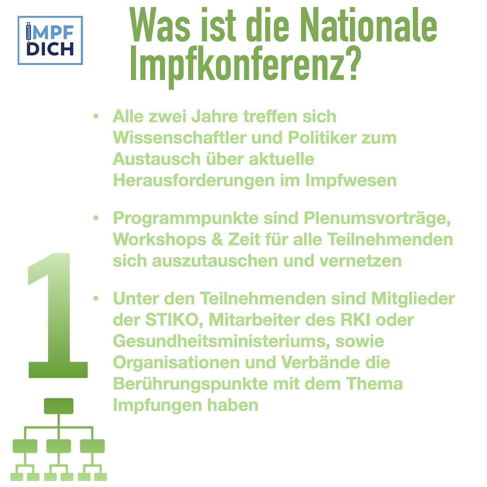
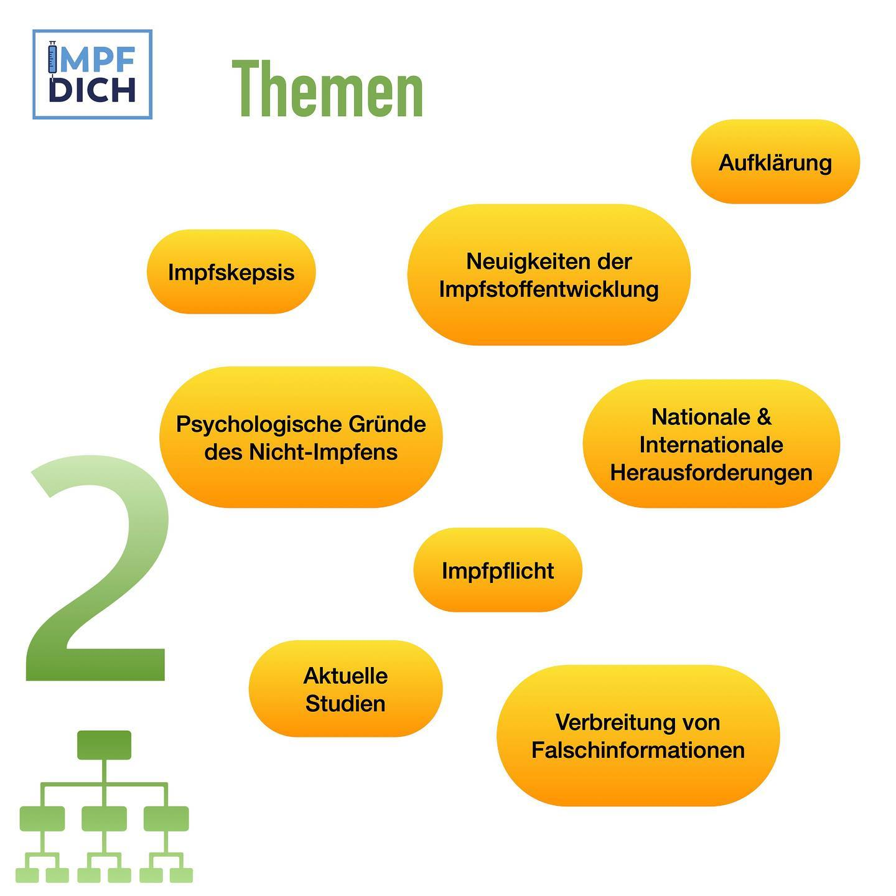
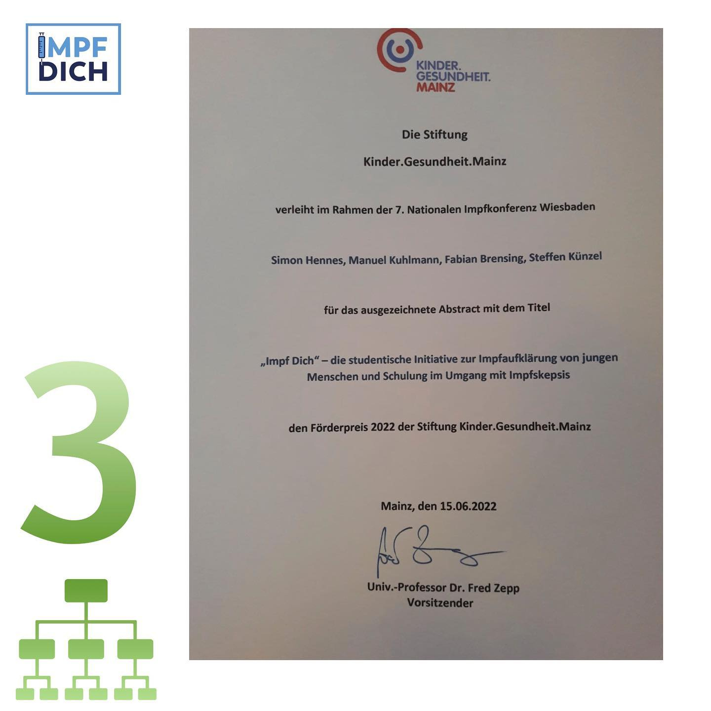

Was läuft im Moment hinter den Kulissen von Impf Dich ab?  
  
Im Rahmen der 7. Nationalen Impfkonferenz in Wiesbaden erhielt Vorstandsvorsitzender Simon Hennes die Möglichkeit die Initiative "Impf Dich" in Form eines Posters-Vortrags vorzustellen, was sehr positiv aufgenommen wurde.   
"Impf Dich" wurde infolgedessen mit dem Förderpreis 2022 der Stiftung Kinder.Gesundheit.Mainz ausgezeichnet.   
  
Darüber hinaus ermöglichte die Konferenz einen offenen Austausch mit Mitarbeitern des Robert Koch-Instituts und Mitgliedern der STIKO. Die Experten sind überzeugt von der Relevanz unserer Aufklärungsarbeit und von verschiedener Seite wurde uns Unterstützung zugesprochen.   
  
Von der Kooperation mit anderen wissenschaftlichen Organisationen kann Impf Dich profitieren was unsere Projekte und unsere Aufklärung vorantreibt.   
  
Einen Artikel in der Ärztezeitung über die vorgestellten Projekte von Impf Dich auf der Nationalen Impfkonferenz findet ihr über den Link in unserer Bio.

