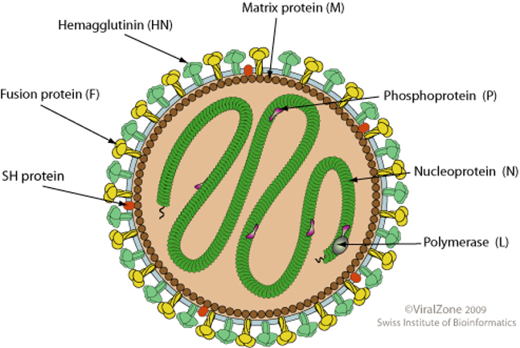

1\. Die Krankheit
=================

### *1.1 Der Erreger*

Mumps wird durch das Mumpsvirus (ältere Bezeichnung: Paramyxovirusparotitis) ausgelöst, das zur Familie der Paramyxoviridae zählt. Das Mumpsvirus ist humanpathogen, d. h. es kann Krankheiten im menschlichen Körper auslösen, in diesem Fall Mumps. Paramyxoviridae werden durch eine Proteinhülle (Kapsid) umgeben und zeichnen sich generell durch ihr Erbgut (Genom), das aus einer einzelsträngigen Ribonukleinsäure (RNA) mit negativer Polarität besteht, sowie durch eine besondere Hüllenstruktur aus. Auch das Mumpsvirus verfügt über diese Charakteristika^1,2^.

Durchschnittlich besitzt das nahezu rund geformte Mumpsvirus einen Durchmesser von 150 nm und wird von einer Hülle aus den zwei Hüllproteinen F1 und F2 umgeben. Dabei katalysiert das F1-Protein die Spaltung von Glykoproteinen in der Membran der Wirtszelle, sodass das Virus in diese eindringen kann. Das an der Innenseite der Hülle befindliche Matrixprotein, das die Bindung zwischen Virushülle und Kapsid vermittelt³, erleichtert die Synthese neuer Viruspartikel an der Zellmembran bei Austritt aus der infi zierten Zelle. Zudem ist die Hülle des Mumpsvirus fetthaltig (lipidhaltig), was seine Empfindlichkeit gegenüber Austrocknung sowie fettlösenden Substanzen erklärt. Das Virus ist außerdem sehr empfindlich gegenüber Licht, UV-Strahlen und Desinfektionsmitteln^2,4^.

*^Abbildung 1: Aufbau des Mumpsvirus aus:^ *[*^https://viralzone.expasy.org/resources/Rubulavirus_virion.jpg^*](https://viralzone.expasy.org/resources/Rubulavirus_virion.jpg)*^(03.04.2021)^*

Genotypisch, d. h. abhängig von der Erbinformation des jeweiligen Virus, werden Mumpsviren in die Gruppen A bis N eingeteilt, da sich verschiedene Arten des Virus in ihren biologischen Eigenschaften wie der Neurovirulenz (mögliche Auslösung von Krankheit im Nervengewebe) oder der Fähigkeit zur Kreuzreaktion unterscheiden^4^. Dabei versteht man unter einer Kreuzreaktion eine „Reaktion, bei der ein Antikörper an ein Antigen bindet, das nicht zur Herstellung des Antikörpers verwendet wurde"^5^. Während die Genotypen A, C, D, G und H insbesondere in der westlichen Hemisphäre auftreten, werden die Genotypen B, F, I, J/K sowie L vorrangig im asiatischen und pazifischen Raum beobachtet. In den letzten Jahren wurden die meisten Mumpsinfektionen in Deutschland dabei „durch den Genotyp G verursacht, dessen Auftreten weltweit zunimmt"^4^.

#### *1.2 Epidemiologie (Verbreitung und Übertragbarkeit)*

Mumps tritt insbesondere im Alter von zwei bis 15 Jahren auf^6^. Es kann aber prinzipiell bei jedem Menschen ausbrechen, der noch nie an Mumps erkrankt ist (eine durchgemachte Infektion führt zu lebenslanger Immunität) oder nicht vollständig durch eine Impfung geschützt ist. Jugendliche und Erwachsene tragen dabei ein höheres Risiko für einen komplikationsreicheren Krankheitsverlauf als Kinder^7^. In der Vergangenheit waren vor allem Kinder und Jugendliche bzw. junge Erwachsene von Mumps betroffen, jedoch fand nach Einführung der Impfung eine Verschiebung in höhere Krankheitsalter statt^4^.

In Deutschland erkranken aktuell mehr Jungen als Mädchen an Mumps^6^ und ca. 90% der Bevölkerung sind gegen Mumps immunisiert^8^. Seit Einführung der Meldepflicht 2013 wurden durchschnittlich 700 Infektionen pro Jahr registriert. 2018 betrug so die Rate der Neuerkrankungen (Inzidenz) 0,6 Erkrankungen pro 100.000 Einwohner in Deutschland. Das Virus tritt jedoch auch weltweit und ganzjährig auf, wobei man vor Einführung der Impfung ein gehäuftes Auftreten von Mumps im Frühjahr und im Winter feststellen konnte^4^.

Eine Übertragung des Virus findet nur von Mensch zu Mensch statt, wobei eine infizierte Person sieben Tage vor und bis neun Tage nach Ausbruch der Erkrankung ansteckend ist. Da der Speichel eines infizierten Menschen besonders ansteckend (kontagiös) ist^6^, auch bei asymptomatischen Verläufen, verbreiten sich die Erreger insbesondere durch Tröpfcheninfektion beim Husten, Niesen oder Sprechen. Die sich in der Luft verbreitenden Viren können anschließend von einer weiteren, nicht infizierten Person eingeatmet werden, sodass der Ort einer Neuinfektion meist die Schleimhaut von Mundhöhle und Nasopharynx, d. h. vom oberen Rachenraum, ist^8^. Seltener tritt eine Infektion durch mit Speichel kontaminierte Gegenstände auf. Der Erreger wird außerdem mit Urin und Muttermilch ausgeschieden, was aber praktisch kaum bedeutsam für die Übertragung ist. Auch Schmierinfektionen sind möglich, jedoch bleiben Mumpsviren auf Oberflächen und Gegenständen nur wenige Stunden infektiös^4^. Unter einer Schmierinfektion versteht man dabei eine Kontaktinfektion, also eine Infektion durch Kontakt mit kontaminierten Oberflächen.

#### *1.3 Pathogenese (Entstehung und Entwicklung der Krankheit)*

Nach dem Eintritt in die Schleimhaut von Mundhöhle und oberem Rachenraum (Nasopharynx) durch Tröpfcheninfektion (s. 1.2) vermehrt sich das Virus sowohl in diesen Schleimhäuten als auch in den Lymphknoten weiter. Daraus ergibt sich anschließend eine Virämie, d. h. Viren treten (massiv) ins Blut über und können so sekundäre Infektionen verursachen, z. B. in den Speicheldrüsen wie der Ohrspeicheldrüse (Parotis). Eine Ausbreitung der Mumpsviren in weiteres Gewebe ist ebenso möglich, z. B. in Tränen-, Schild-, Brust- oder Bauchspeicheldrüse sowie Hoden, Eierstöcke oder das Nervensystem^8^. Dabei ist das Mumpsvirus in der Lage, die Immunantwort zu unterdrücken.^9^

#### *1.4 Immunreaktion*

Die Inkubationszeit von Mumps beträgt etwa zwölf bis 25 Tage^6^. Die Krankheit beginnt meist mit einer ein- bis zweitägigen Phase mit unspezifischen, grippeähnlichen Symptomen wie steigendem Fieber, Kopf- und Gelenkschmerzen^8^, Unwohlsein sowie Appetitverlust^4^. Zudem verringert sich der Allgemeinzustand^6^. Wenig später tritt zusätzlich die für Mumps charakteristische (meistens zuerst linksseitige) Schwellung einer Ohrspeicheldrüse (Glandula parotis) auf, wobei bei ca. 75% der Patient*innen ein bis zwei Tage später auch die zweite Ohrspeicheldrüse erfasst wird. So entsteht schließlich das typische „Mumps-Gesicht" mit deutlich abstehenden Ohrläppchen sowie gespannter und ödematöser Haut über der Schwellung beider Ohrspeicheldrüsen^8^. Diese Schwellung dauert etwa drei bis acht Tage an^4^.

*^Abbildung 2: Aussehen eines Mumps-Gesichts aus:^ *[*^https://dgk.de/fileadmin/_processed_/8/d/csm_d-010-05-05-c_kind_mitmumps_gr_rgb_757f7b4d83.jpg^*](https://dgk.de/fileadmin/_processed_/8/d/csm_d-010-05-05-c_kind_mitmumps_gr_rgb_757f7b4d83.jpg)*^(03.04.2021)^*

In 10-15% der Fälle können auch die Unterkiefer-Speicheldrüsen und Unterzungen-Speicheldrüsen (Glandula submandibularis und Glandula sublingualis) betroffen sein. Die entzündeten Speicheldrüsen sind dabei nicht eitrig, jedoch sehr schmerzhaft. Durch eine Rötung und Schwellung des Ausführungsganges der Ohrspeicheldrüse (Glandula parotis), auch als Ductus parotideus bezeichnet, treten häufig Schmerzen beim Kauen oder diffuse Ohrschmerzen auf. Außerdem kann die Bewegung des Kopfes schmerzhaft sein^8^. In etwa 50% der Fälle verläuft die Infektion mit Mumps aber auch asymptomatisch oder löst nur grippeähnliche Symptome aus^6^.

*^Abbildung 3: Lage der Speicheldrüsen aus:^ *[*^https://www.zm-online.de/fileadmin/migrated/news/1984672_514a092b60.jpg^*](https://www.zm-online.de/fileadmin/migrated/news/1984672_514a092b60.jpg)*^(03.04.2021)^*

#### *1.5 Therapie*

Im Falle einer Infektion mit Mumps gibt es keine ursächliche, d. h. spezifische antivirale Therapie. Man kann nur versuchen, die Krankheit symptomatisch, also durch Linderung der Beschwerden, zu behandeln^4^.

Eingesetzt werden z. B. Wärme- oder Kälteanwendungen an den geschwollenen Speicheldrüsen oder Medikamente wie Paracetamol und Ibuprofen, um die Schmerzen zu lindern und das Fieber zu senken. Kaubeschwerden können durch den Verzehr weicher Nahrung vermindert werden und auch säurehaltige Getränke (z. B. Fruchtsäfte) oder Speisen sollten vermieden werden, da sie den Speichelfluss anregen und dadurch die Schmerzen in den Speicheldrüsen verstärken^10^. Sollten Komplikationen wie die Mumps-Orchitis (Hodenentzündung) oder eine enzephalitische (das Gehirn betreffende) Beteiligung auftreten, ist zusätzlich eine Therapie mit Kortikosteroiden indiziert^8^.

#### *1.6 Spätfolgen einer Infektion*

Aufgrund der Verteilung der Mumpsviren im Blutkreislauf (Virämie) können sie auch andere Gewebe außer den Speicheldrüsen infizieren^6^. So kommt es bei ca. 4% der Mumps-Infektionen zu einer Pankreatitis (Bauchspeicheldrüsenentzündung)^4^, die sich durch Erbrechen, Übelkeit und starke Oberbauchschmerzen äußert^6^. Auch weitere Entzündungen sind möglich: So kann es beispielsweise zu einer Thyreoiditis (Schilddrüsenentzündung), Iritis (Entzündung der Regenbogenhaut des Auges), Myokarditis (Herzmuskelentzündung), Arthritis (Entzündung großer Gelenke) oder Nephritis (Nierenentzündung) kommen^10^.

Darüber hinaus sind oft die Keimdrüsen (Gonaden) betroffen: Bei einer Mumps-Infektion in der Pubertät entwickeln 20-30% der Betroffenen eine Hodenentzündung (Orchitis), ansonsten tritt diese seltener auf. Die Orchitis äußert sich durcheinen starken Druckschmerz sowie eine deutliche Schwellung des Hodens (oft einseitig und ggf. im Verlauf beidseitig). Diese Orchitis kann dabei zum Gewebeschwund (Atrophie) des Hodens oder selten sogar zur Unfruchtbarkeit führen^6^. Analog dazu tritt bei etwa 5% der infizierten weiblichen Patientinnen eine Oophoritis (Eierstockentzündung) auf^8^.

Zu den häufigsten Komplikationen zählt zudem eine Beteiligung des zentralen Nervensystems^4^: Bei etwa 5-10% der infizierten Personen tritt eine seröse Meningitis (Entzündung der Hirn- und Rückenmarkshäute) mit guter Prognose auf^6^. Jedoch sind auch 0,1% der Mumps-Patient*innen von einer Meningoenzephalitis (kombinierte Entzündung des Gehirns und der Hirnhäute) betroffen^8^, die mit Bewusstseinsstörungen und Krampfanfällen einhergeht. Sie verursacht verschiedenste neurologische Ausfälle wie Hirnnervenlähmung, Hemiplegien (auf einer Körperseite auftretende vollständige Lähmungen von Muskelgruppen oder Extremitäten) und sehr selten Innenohrschwerhörigkeit^6^ (1:10.000 Patient*innen^8^). Diese äußert sich meistens durch eine einseitige, manchmal jedoch auch eine beidseitige Ertaubung^10^. Zur Feststellung dieser Innenohrschwerhörigkeit sollte nach der ausgeheilten Ohrspeicheldrüsen-Entzündung (Parotitis) ein Hörtest (Audiogramm) durchgeführt werden^8^.

2\. Der Impfstoff
=================

Die Schutzimpfung gegen Mumps ist derzeit die wirksamste präventive Maßnahme. Dabei handelt es sich um einen Kombinationsimpfstoff für Masern-Mumps-Röteln oder Masern-Mumps-Röteln-Varizellen (Windpocken) kurz MMR bzw. MMRV-Vakzine.

In Deutschland wird der Impfstoff als Spritzimpfung in zwei Impfdosen verabreicht:

-   Erste Dosis: 11-14 Monate
-   Zweite Dosis: 15-23 Monate^4^ (frühestens 4 Wochen nach erster Injektion^8^)

Wenn Impfungen versäumt wurden, sollten sie bis zum 18. Geburtstag nachgeholt werden, jedoch gibt es keine Altersbegrenzung für die Verabreichung der Impfung^4^. Nach der ersten Impfdosis kann Mumps bereits bei 64-66% der geimpften Personen vermieden werden, nach der zweiten Impfdosis sogar bei 83-88%. Bei Menschen, die trotz Impfung erkranken, wurde ein leichterer Krankheitsverlauf festgestellt^11^.

#### *2.1 Wirkmechanismus*

Der Mumps-Impfstoff ist ein Lebendimpfstoff^4^, d. h. er enthält eine vermehrungsfähige (aktive), aber abgeschwächte (attenuierte) Form des Virus. So können Antikörper gegen diesen Krankheitserreger gebildet werden, wodurch eine körpereigene, langanhaltende Immunität ausgebildet wird. Bereits die erste Dosis eines Lebendimpfstoffs bietet in der Regel einen Impfschutz. Die zweite Dosis wird nicht zur Auffrischung verabreicht, sondern soll erstgeimpfte Personen erreichen, die nach der ersten Dosis noch keine oder nicht genügend Antikörper gegen das Virus gebildet haben^12^.

#### *2.2 Inhaltsstoffe und Herstellung*

Der Impfstoff enthält attenuierte, auf Hühnerembryozellen gezüchtete Mumpsviren. Er ist seit 1976 als MMR- bzw. seit 2006 als MMRV-Vakzin zugelassen^4^.

Für die Impfung stehen in Deutschland aktuell ausschließlich Kombinationsimpfstoffe zur Verfügung^13^. Da mit einem Impfstoff gleich mehrere Krankheiten vorgebeugt werden und sich so die Anzahl an Impfungen deutlich verringern lässt, entspricht das der generellen Empfehlung der Ständigen Impfkommission (STIKO)^14^. Eine Impfdosis kostet ca. 40 €^15^, jedoch werden von der STIKO empfohlene Impfungen „üblicherweise von den Krankenkassen finanziert und sind beihilfefähig"^16^, insofern sind auch die Impfungen mit MMR- oder MMRV-Impfstoffen für die zu impfenden Personen in der Regel kostenlos.

#### *2.3 Impfwirkungen und -nebenwirkungen*

Die Impfung ist trotz möglicher Impfreaktionen gut verträglich: Bei fünf von 100 geimpften Personen wurde innerhalb der ersten drei Tagen nach der Impfung von einer Rötung, Schwellung und Schmerzen an der Injektionsstelle berichtet, was durch die Anregung der körpereigenen Abwehr verursacht wird. Zudem werden gelegentlich geschwollene Lymphknoten in der Nähe der Einstichstelle sowie kurzfristige Allgemeinsymptome wie leichte bis mäßige Temperaturerhöhung, Kopfschmerzen, Mattigkeit sowie Magen-Darm-Beschwerden beobachtet."^14^ Bei zwei bis fünf von 100 geimpften Personen trat innerhalb von ein bis vier Wochen nach der Impfung Fieber mit einem masernähnlichen Ausschlag auf, zudem in manchen Fällen eine leichte Schwellung der Ohrspeicheldrüse. Auch Gelenkbeschwerden (vor allem im Jugend- und Erwachsenenalter, sehr selten bei Kindern) oder eine seltene leichte Hodenschwellung wurden dokumentiert^14^.

Diese Formen einer Impfreaktion treten normalerweise nur vorübergehend auf und entwickeln sich nach kurzer Zeit wieder folgenlos zurück. Sie sind Ausdruck für die Reaktion des Immunsystems auf das abgeschwächte Virus der Impfung, sodass Antikörper gegen den Erreger gebildet werden können^14^, was schließlich auch die gewünschte Wirkung des Impfstoffes ist (s. 2.1).

Selten treten bei der Impfung Nebenwirkungen auf, so z. B. Fieberkrämpfe bei Säuglingen oder jungen Kleinkindern im Zusammenhang mit einer Erhöhung der Körpertemperatur, wobei die Kinder kurz bewusstlos werden und sich die Muskeln verkrampfen können. Normalerweise endet solch ein Fieberkrampf von selbst und verursacht keine Folgeschäden. Sehr selten treten außerdem allergische Reaktionen gegen den Impfstoff oder längerfristige Gelenkbeschwerden auf. In Einzelfällen wurde über eine vorübergehend verringerte Zahl der Blutplättchen berichtet, wobei diese Blutgerinnungsstörung leicht verläuft und sich nach einigen Tagen bis Wochen wieder von selbst zurückbildet. Ebenfalls in wenigen Einzelfällen weltweit wurde als sehr seltene Nebenwirkung eine Gehirnentzündung vermutet, jedoch konnte kein Zusammenhang mit der Impfung belegt werden^14^.

Nicht geimpft werden darf bei einer akuten, behandlungsbedürftigen Erkrankung und Fieber, bei bestimmten Beeinträchtigungen des Immunsystems (s. auch [Hinweise zu Impfungen für Patienten mit Immundefizienz](https://www.rki.de/DE/Content/Kommissionen/STIKO/Empfehlungen/STIKO_Weitere/Tabelle_Immundefizienz.html?nn=2375548), RKI), während einer Schwangerschaft oder bei einer bekannten Überempfindlichkeit gegen Impfstoffbestandteile^17^.

3\. Aktuelles
=============

Änderung der Empfehlung zur Impfung gegen Mumps; publiziert im Epid. Bull. 31/2012 (<http://www.rki.de/epidbull%20%3e%20Ausgabe%2031/12>): Detaillierte Empfehlung zur Impfung von Personen mit unvollständiger oder unbekannter Impfanamnese veröffentlicht

4\. Auffrischung und Impfung im späteren Lebensalter
====================================================

Für die Impfung besteht keine Altersbegrenzung^4^. Nach zweimaliger Impfung mit dem MMR(V)-Impfstoff wird in der Regel die lebenslange vollständige Grundimmunisierung erreicht und auch leicht sinkende Titer (Messung der Mumps-Antikörper im Blut) schränken den Impfschutz nach aktuellem Kenntnisstand nicht ein, sodass keine Auffrischimpfung nötig ist^17^.

5\. STIKO-Stellungnahme
=======================

Die Ständige Impfkommission (STIKO) empfiehlt die zweimalige Impfung gegen Mumps

-   allen Kindern ab einem Alter von 11 bis 14 Monaten.
-   Mitarbeiter*innen in der unmittelbaren Patient*innenversorgung, in Gemeinschaftseinrichtungen oder in Ausbildungseinrichtungen für junge Erwachsene, die nach 1970 geboren sind, wenn diese nicht oder nur einmal in der Kindheit gegen Mumps geimpft wurden oder der Impfstatus unklar ist.^4^

6\. Impfempfehlungen in anderen Ländern
=======================================

Die Impfung mit MMR/MMRV-Vakzinen wird von den meisten nationalen und internationalen Gesundheitseinrichtungen empfohlen, so z. B. auch von den CDC (Centers for Disease Control and Prevention)^18^ des US-amerikanischen Gesundheitsministeriums. Im Zusammenhang mit den MMR/MMRV-Kombinationsimpfstoffen, die neben einer Immunisierung gegen Mumps auch Schutz gegen Masern bieten, arbeitet die WHO (World Health Organisation) im Rahmen des „Global Measles & Rubella Strategic Plan 2012-2020" zudem am Erreichen einer höheren Impfrate, um die Masern-Sterblichkeit zu senken und schließlich die Masern auszurotten^19^.

7\. Quellen
===========

[1]  <https://flexikon.doccheck.com/de/Paramyxoviridae> (04.09.2020), Paramyxoviren, DocCheckFlexikon

[2]  <https://flexikon.doccheck.com/de/Mumpsvirus> (04.09.2020), Mumpsvirus, DocCheckFlexikon

[3] <https://flexikon.doccheck.com/de/Matrixprotein> (06.04.2021), Matrixprotein, DocCheckFlexikon

[4]<https://www.rki.de/DE/Content/Infekt/EpidBull/Merkblaetter/Ratgeber_Mumps.html> (06.04.2021), Mumps, Robert-Koch-Institut

[5] <https://www.spektrum.de/lexikon/biologie/kreuzreaktion/37382> (06.04.2021), Lexikon der\
Biologie: Kreuzreaktion, „Spektrum der Wissenschaft"-Verlag

[6] <https://www.amboss.com/de/wissen/Mumps> (06.04.2021), Mumps, AMBOSS - Wissen für Mediziner

[7] <https://www.infektionsschutz.de/erregersteckbriefe/mumps.html> (04.09.2020), Mumps,\
Bundeszentrale für gesundheitliche Aufklärung

[8] <https://flexikon.doccheck.com/de/Mumps> (06.04.2021), Mumps, DocCheckFlexikon

[9] <https://www.wikidoc.org/index.php/Mumps_pathophysiology> (06.04.2021), Mumps\
pathophysiology, WikiDoc

[10] <https://de.wikipedia.org/wiki/Mumps> (04.09.2020), Mumps, Wikipedia

[11] <https://www.rki.de/SharedDocs/FAQ/Impfen/MMR/FAQ-Liste_Mumps_Impfung.html> (06.04.2021), Schutzimpfung gegen Mumps: Häufig gestellte Fragen und Antworten, Robert-Koch-Institut

[12] <https://www.amboss.com/de/wissen/Impfungen_allgemein> (06.04.2021), Impfungen allgemein, AMBOSS - Wissen für Mediziner

[13] <https://www.pei.de/DE/arzneimittel/impfstoffe/mumps/mumps-node.html> (04.09.2020), Mumps-Impfstoffe, Paul-Ehrlich-Institut

[14] <https://www.impfen-info.de/impfempfehlungen/fuer-kinder-0-12-jahre/mumps.html> (06.04.2021), Mumps-Impfung bei Kindern, Bundeszentrale für gesundheitliche Aufklärung

[15] <https://www.klinikumdo.de/impfcentrum/kosten.php> (30.04.2021), Kosten: Reiseimpfungen, MVZ Klinikum Dortmund GmbH: Institut für Krankenhaushygiene und Klinische Mikrobiologie

[16] <https://www.rki.de/SharedDocs/FAQ/Impfen/AllgFr_Kosten/Kostenuebernahme.html> (06.04.2021), Übernahme von Kosten für Schutzimpfungen, Robert-Koch-Institut

[17] <https://www.netdoktor.de/krankheiten/mumps/impfung/> (06.04.2021), Mumps-Impfung,\
NetDoktor

[18] <https://www.cdc.gov/vaccines/vpd/mmr/public/index.html> (04.09.2020), Measles, Mumps, and Rubella (MMR) Vaccination: What Everyone Should Know, Centres for Disease Control and\
Prevention

[19] <https://www.who.int/immunization/diseases/measles/global_coordination/en/index3.html>\
(04.09.2020), Measles, World Health Organization